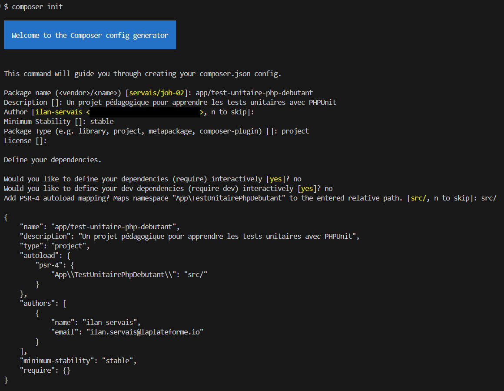
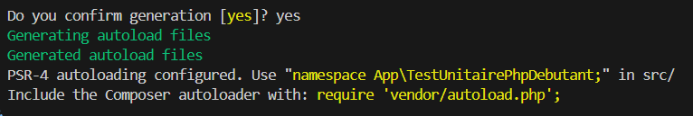
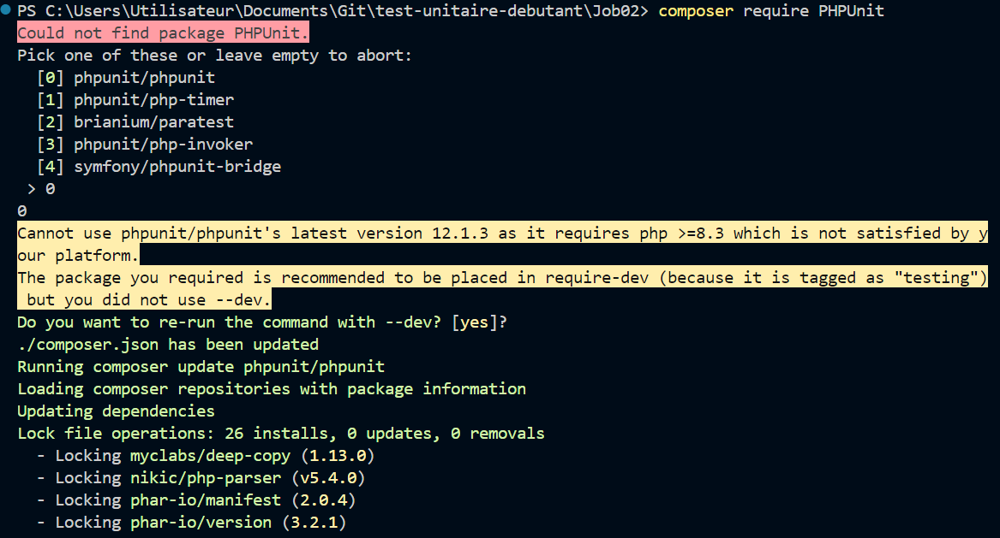

# Test Unitaire PHP Débutant

Ce projet est un tutoriel pour apprendre les bases des tests unitaires avec PHPUnit en PHP.

## Table des matières
- [Étape 1 - Initialisation du projet](#étape-1---initialisation-du-projet)
- [Étape 2 - Installation de PHPUnit](#étape-2---installation-de-phpunit)
- [Étape 3 - Structure du projet](#étape-3---structure-du-projet)
- [Étape 4 - Création de la classe Math](#étape-4---création-de-la-classe-math)
- [Étape 5 - Création du test unitaire](#étape-5---création-du-test-unitaire)
- [Étape 6 - Exécution des tests réussis](#étape-6---exécution-des-tests-réussis)
- [Étape 7 - Simulation d'erreur](#étape-7---simulation-derreur)
- [Étape 8 - Correction et vérification](#étape-8---correction-et-vérification)
- [Concepts de tests unitaires en PHP](#concepts-de-tests-unitaires-en-php)
- [Bonnes pratiques](#bonnes-pratiques)
- [Ressources utiles](#ressources-utiles)
- [Checklist du projet](#checklist-du-projet)

## Étape 1 - Initialisation du projet

Création d'un nouveau projet PHP avec Composer:

```bash
composer init
```




📝 Création du projet PHP avec Composer qui génère un fichier composer.json pour gérer les dépendances.

## Étape 2 - Installation de PHPUnit

Installation de PHPUnit comme dépendance de développement:

```bash
composer require --dev phpunit/phpunit
```



📝 Installation de PHPUnit, le framework de test que nous utiliserons pour écrire et exécuter nos tests unitaires en PHP.

## Étape 3 - Structure du projet

Création de la structure du projet:

```bash
mkdir src
mkdir tests
```


📝 Organisation du projet avec un dossier src/ pour le code source et un dossier tests/ pour les tests unitaires.

## Étape 4 - Création de la classe Math

Création du fichier Math.php dans le dossier src/:

```php
<?php

namespace App;

class Math
{
    /**
     * Additionne deux nombres
     * 
     * @param int|float $a Premier nombre
     * @param int|float $b Second nombre
     * @return int|float Somme des deux nombres
     */
    public function addition($a, $b)
    {
        return $a + $b;
    }
}
```


📝 Création d'une classe Math avec une méthode addition qui prend deux paramètres et retourne leur somme.

## Étape 5 - Création du test unitaire

Création du fichier MathTest.php dans le dossier tests/:

```php
<?php

use PHPUnit\Framework\TestCase;
use App\Math;

class MathTest extends TestCase
{
    /**
     * Teste l'addition de deux nombres positifs
     */
    public function testAdditionPositiveNumbers()
    {
        // Arrange
        $math = new Math();
        $a = 2;
        $b = 3;
        $expected = 5;
        
        // Act
        $result = $math->addition($a, $b);
        
        // Assert
        $this->assertEquals($expected, $result);
    }
    
    /**
     * Teste l'addition d'un nombre positif et d'un nombre négatif
     */
    public function testAdditionPositiveAndNegative()
    {
        $math = new Math();
        $this->assertEquals(-1, $math->addition(2, -3));
    }
    
    /**
     * Teste l'addition de deux nombres négatifs
     */
    public function testAdditionNegativeNumbers()
    {
        $math = new Math();
        $this->assertEquals(-5, $math->addition(-2, -3));
    }
    
    /**
     * Teste l'addition avec zéro
     */
    public function testAdditionWithZero()
    {
        $math = new Math();
        $this->assertEquals(5, $math->addition(5, 0));
    }
}
```


📝 Création d'une classe de test qui hérite de TestCase avec plusieurs méthodes de test pour vérifier le fonctionnement de la méthode addition.

## Étape 6 - Exécution des tests réussis

Configuration de l'autoloading dans composer.json:

```json
"autoload": {
    "psr-4": {
        "App\\": "src/"
    }
}
```

```bash
composer dump-autoload
```

Lancement des tests:

```bash
vendor/bin/phpunit tests
```


📝 Exécution des tests avec succès, tous les tests passent car notre méthode addition est correctement implémentée.

## Étape 7 - Simulation d'erreur

Modification de la méthode addition pour introduire une erreur:

```php
public function addition($a, $b)
{
    return $a - $b; // Bug volontaire: soustraction au lieu d'addition
}
```

Lancement des tests:

```bash
vendor/bin/phpunit tests
```


📝 Simulation d'une erreur dans notre code pour voir comment PHPUnit signale les échecs de tests. Nous avons remplacé l'addition par une soustraction.

## Étape 8 - Correction et vérification

Correction de la méthode addition:

```php
public function addition($a, $b)
{
    return $a + $b; // Correction: retour à l'addition
}
```

Lancement des tests:

```bash
vendor/bin/phpunit tests
```


📝 Correction de l'erreur et vérification que tous les tests passent à nouveau.

## Concepts de tests unitaires en PHP

### Structure d'un test PHPUnit

1. **Hériter de TestCase**: Votre classe de test doit étendre `PHPUnit\Framework\TestCase`.
2. **Méthodes de test**: Les noms doivent commencer par "test" ou utiliser l'annotation @test.
3. **Assertions**: PHPUnit fournit de nombreuses méthodes d'assertion comme assertEquals(), assertTrue(), etc.

### Pattern AAA

1. **Arrange**: Préparation des données et des objets pour le test
2. **Act**: Exécution de la méthode ou fonction à tester
3. **Assert**: Vérification que le résultat correspond à ce qui est attendu

## Bonnes pratiques

- Écrire des tests spécifiques et ciblés
- Nommer clairement les méthodes de test
- Tester les cas normaux et les cas limites
- Maintenir l'indépendance des tests
- Utiliser des mocks pour isoler le code testé des dépendances externes
- Faire des commits réguliers avec des messages descriptifs

## Ressources utiles

- [Documentation PHPUnit](https://phpunit.de/documentation.html)
- [PHP: The Right Way](https://phptherightway.com/)
- [Composer Documentation](https://getcomposer.org/doc/)

## Checklist du projet

- [ ] Initialisation du projet avec `composer init`
- [ ] Installation de PHPUnit avec `composer require --dev phpunit/phpunit`
- [ ] Création des dossiers src/ et tests/
- [ ] Création de la classe Math dans src/Math.php
- [ ] Création du test dans tests/MathTest.php
- [ ] Configuration de l'autoloading dans composer.json
- [ ] Exécution réussie des tests
- [ ] Simulation d'une erreur et vérification de l'échec des tests
- [ ] Correction de l'erreur et vérification du succès des tests
- [ ] Ajout des images dans le dossier images/
- [ ] Mise à jour du fichier README.md
- [ ] Dépôt GitHub avec commits clairs
