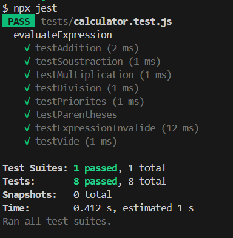

# Job-03 : Tests unitaires pour calculatrices PHP & JavaScript

Ce projet pédagogique propose deux calculatrices (une en PHP, une en JavaScript) et leur batterie de tests unitaires.

## Structure du projet

```
Job-03/
│
├── calculator.php                 # Classe PHP à tester
├── Calculator_PHP.php             # Interface PHP
├── calculator.js                  # Fonction JS à tester
├── Calculator_JS.html             # Interface HTML
├── calculator.css                 # Style commun
│
├── tests/
│   ├── CalculatorTest.php         # Tests PHPUnit
│   └── calculator.test.js         # Tests Jest
│
├── images/
│   └── (captures d’écrans)
│
├── README.md
```

## Prérequis

- PHP et Composer installés pour les tests PHP
- Node.js et npm installés pour les tests JS

## Installation

### Initialiser le projet PHP (si ce n'est pas déjà fait)

Si tu n'as pas encore de fichier `composer.json` dans `Job-03`, commence par initialiser Composer :

```bash
composer init
```


Suis les instructions pour générer le fichier.

### Installer PHPUnit (si ce n'est pas déjà fait)

```bash
composer require --dev phpunit/phpunit
```


### Installer les dépendances PHP

```bash
composer install
```


### Initialiser le projet JS (si ce n'est pas déjà fait)

Si tu n'as pas encore de fichier `package.json` dans `Job-03`, commence par initialiser npm :

```bash
npm init -y
```


Cela va créer le fichier `package.json` nécessaire pour installer Jest et les dépendances JS.

### Installer les dépendances JS (Jest)

```bash
npm install
```

## Exécution des tests

### Tests PHP (PHPUnit)

Lancer tous les tests unitaires PHP :

```bash
vendor/bin/phpunit tests
```
ou (si le premier ne fonctionne pas sous Windows) :
```bash
php vendor/bin/phpunit tests
```


### Tests JavaScript (Jest)

Lancer tous les tests unitaires JS :

```bash
npx jest
```
ou simplement :
```bash
npm test
```


## Vérification du bon fonctionnement des tests (simulation d'une erreur)

Pour s'assurer que le système de tests détecte bien les erreurs, un test volontairement erroné a été ajouté (par exemple, en modifiant une assertion pour qu'elle échoue).  
Lors de l'exécution, PHPUnit (ou Jest) affiche alors un message d'échec, ce qui permet de valider que la suite de tests fonctionne correctement.

Exemple de résultat attendu lors d'un test échoué :


📝 Cette étape permet de vérifier que les tests signalent bien les erreurs dans le code, ce qui est essentiel pour la fiabilité du projet.

## Liens utiles

- [Documentation PHP](https://www.php.net/manual/fr/)
- [Documentation PHPUnit](https://phpunit.de/documentation.html)
- [Documentation Node.js](https://nodejs.org/fr/docs/)
- [Documentation Jest](https://jestjs.io/docs/getting-started)
- [Regex MDN](https://developer.mozilla.org/fr/docs/Web/JavaScript/Guide/Regular_expressions)

## Checklist

- [x] Tests unitaires PHP écrits et passés
- [x] Tests unitaires JS écrits et passés
- [x] Captures d’écran prises et intégrées
- [x] README à jour
- [x] Commits réguliers et professionnels

### Remarque sur "entry point: (calculator.js)"

Quand tu fais `npm init`, il te demande :
```
entry point: (index.js)
```
Tu peux simplement appuyer sur **Entrée** pour accepter la valeur par défaut (`index.js`), ou bien écrire `calculator.js` si tu veux que ce fichier soit le point d’entrée principal du projet JS.  
Dans le cadre des tests unitaires, ce choix n’a pas d’impact : Jest va tester les fichiers spécifiés dans le dossier `tests/` même si le point d’entrée est `index.js` ou `calculator.js`.

**Résumé :**  
- Appuie sur Entrée pour accepter la valeur proposée, ou écris `calculator.js` si tu préfères.  
- Ce choix n’empêche pas d’utiliser Jest ni d’exécuter tes tests.
