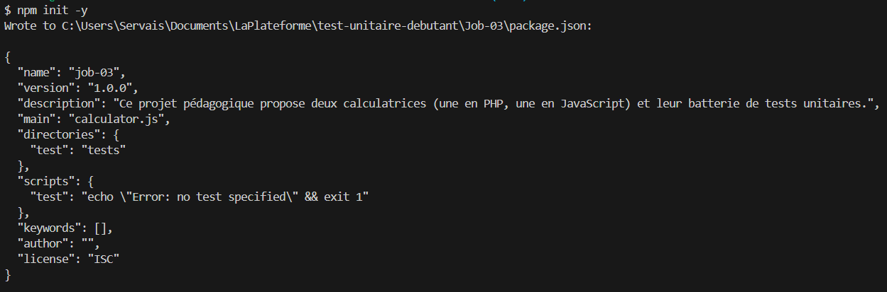

# Job-03 : Tests unitaires pour calculatrices PHP & JavaScript

Ce projet pédagogique propose deux calculatrices (une en PHP, une en JavaScript) et leur batterie de tests unitaires.

## Structure du projet

```
Job-03/
│
├── calculator.php                 # Classe PHP à tester
├── Calculator_PHP.php             # Interface PHP
├── calculator.js                  # Fonction JS à tester
├── Calculator_JS.html             # Interface HTML
├── calculator.css                 # Style commun
│
├── tests/
│   ├── CalculatorTest.php         # Tests PHPUnit
│   └── calculator.test.js         # Tests Jest
│
├── images/
│   └── (captures d’écrans)
│
├── README.md
```

## Prérequis

- PHP et Composer installés pour les tests PHP
- Node.js et npm installés pour les tests JS

## Installation

### Initialiser le projet PHP (si ce n'est pas déjà fait)

Si tu n'as pas encore de fichier `composer.json` dans `Job-03`, commence par initialiser Composer :

```bash
composer init
```


Suis les instructions pour générer le fichier.

### Installer PHPUnit (si ce n'est pas déjà fait)

```bash
composer require --dev phpunit/phpunit
```


### Installer les dépendances PHP

```bash
composer install
```


### Initialiser le projet JS (si ce n'est pas déjà fait)

Si tu n'as pas encore de fichier `package.json` dans `Job-03`, commence par initialiser npm :

```bash
npm init -y
```


Cela va créer le fichier `package.json` nécessaire pour installer Jest et les dépendances JS.

### Installer les dépendances JS (Jest)

```bash
npm install
```

## Exécution des tests

### Tests PHP (PHPUnit)

Lancer tous les tests unitaires PHP :

```bash
vendor/bin/phpunit tests
```
ou (si le premier ne fonctionne pas sous Windows) :
```bash
php vendor/bin/phpunit tests
```

### Tests JavaScript (Jest)

Lancer tous les tests unitaires JS :

```bash
npx jest
```
ou simplement :
```bash
npm test
```

## Captures d’écran et documentation

À chaque étape importante (exécution des tests, erreurs, succès), prenez une capture d’écran et placez-la dans le dossier `images/`.  
Intégrez-les dans ce README avec une explication claire.

Exemple :

```md

```

## Liens utiles

- [Documentation PHP](https://www.php.net/manual/fr/)
- [Documentation PHPUnit](https://phpunit.de/documentation.html)
- [Documentation Node.js](https://nodejs.org/fr/docs/)
- [Documentation Jest](https://jestjs.io/docs/getting-started)
- [Regex MDN](https://developer.mozilla.org/fr/docs/Web/JavaScript/Guide/Regular_expressions)

## Checklist

- [x] Tests unitaires PHP écrits et passés
- [x] Tests unitaires JS écrits et passés
- [x] Captures d’écran prises et intégrées
- [x] README à jour
- [x] Commits réguliers et professionnels

### Remarque sur "entry point: (calculator.js)"

Quand tu fais `npm init`, il te demande :
```
entry point: (index.js)
```
Tu peux simplement appuyer sur **Entrée** pour accepter la valeur par défaut (`index.js`), ou bien écrire `calculator.js` si tu veux que ce fichier soit le point d’entrée principal du projet JS.  
Dans le cadre des tests unitaires, ce choix n’a pas d’impact : Jest va tester les fichiers spécifiés dans le dossier `tests/` même si le point d’entrée est `index.js` ou `calculator.js`.

**Résumé :**  
- Appuie sur Entrée pour accepter la valeur proposée, ou écris `calculator.js` si tu préfères.  
- Ce choix n’empêche pas d’utiliser Jest ni d’exécuter tes tests.
