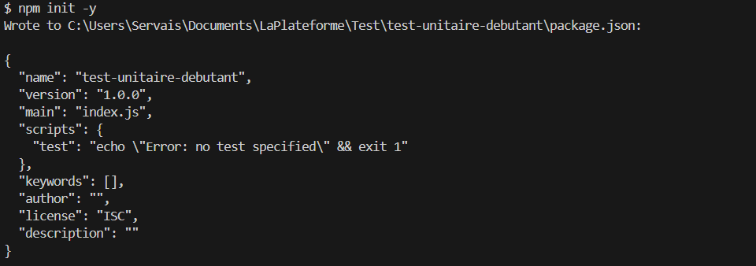
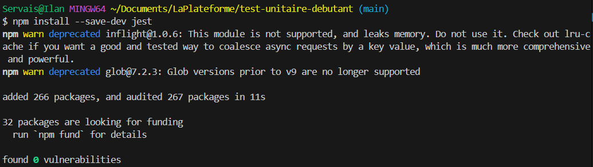

# Test Unitaire Débutant

Ce projet est un tutoriel pour apprendre les bases des tests unitaires avec Jest en JavaScript.

## Table des matières
- [Étape 1 - Initialisation du projet](#étape-1---initialisation-du-projet)
- [Étape 2 - Installation de Jest](#étape-2---installation-de-jest)
- [Étape 3 - Configuration du package.json](#étape-3---configuration-du-packagejson)
- [Étape 4 - Création de la fonction](#étape-4---création-de-la-fonction)
- [Étape 5 - Création des tests unitaires](#étape-5---création-des-tests-unitaires)
- [Étape 6 - Exécution des tests réussis](#étape-6---exécution-des-tests-réussis)
- [Étape 7 - Simulation d'échec de test](#étape-7---simulation-déchec-de-test)
- [Étape 8 - Correction et succès](#étape-8---correction-et-succès)
- [Concepts de tests unitaires](#concepts-de-tests-unitaires)
- [Bonnes pratiques](#bonnes-pratiques)
- [Ressources utiles](#ressources-utiles)
- [Checklist du projet](#checklist-du-projet)

## Étape 1 - Initialisation du projet

Création d'un nouveau projet Node.js avec npm:

```bash
mkdir test-unitaire-debutant
cd test-unitaire-debutant
npm init -y
```



📝 Création du projet Node.js avec la commande `npm init -y` qui génère automatiquement un fichier package.json avec les valeurs par défaut.

## Étape 2 - Installation de Jest

Installation de Jest comme dépendance de développement:

```bash
npm install --save-dev jest
```



📝 Installation de Jest, le framework de test que nous utiliserons pour écrire et exécuter nos tests unitaires.

## Étape 3 - Configuration du package.json

Modification du fichier package.json pour ajouter le script de test:

```json
"scripts": {
  "test": "jest"
}
```


📝 Configuration du script de test dans le fichier package.json pour pouvoir lancer Jest avec la commande `npm test`.

## Étape 4 - Création de la fonction

Création du fichier math.js avec la fonction d'addition:

```javascript
/**
 * Additionne deux nombres
 * @param {number} a - Premier nombre
 * @param {number} b - Second nombre
 * @returns {number} Somme des deux nombres
 */
function addition(a, b) {
  return a + b;
}

module.exports = {
  addition
};
```


📝 Création d'une fonction simple d'addition qui prend deux paramètres et retourne leur somme.

## Étape 5 - Création des tests unitaires

Création du fichier math.test.js avec des tests pour notre fonction:

```javascript
const { addition } = require('./math');

describe('Fonction addition', () => {
  test('additionne correctement deux nombres positifs', () => {
    // Arrange
    const a = 2;
    const b = 3;
    const resultatAttendu = 5;
    
    // Act
    const resultat = addition(a, b);
    
    // Assert
    expect(resultat).toBe(resultatAttendu);
  });

  test('additionne correctement un nombre positif et un nombre négatif', () => {
    expect(addition(2, -3)).toBe(-1);
  });

  test('additionne correctement deux nombres négatifs', () => {
    expect(addition(-2, -3)).toBe(-5);
  });
  
  test('additionne correctement avec zéro', () => {
    expect(addition(0, 5)).toBe(5);
  });
});
```


📝 Création de plusieurs tests unitaires pour vérifier le bon fonctionnement de notre fonction d'addition dans différents scénarios.

## Étape 6 - Exécution des tests réussis

Lancement des tests avec la commande npm test:

```bash
npm test
```


📝 Exécution des tests avec succès, tous les tests passent car notre fonction d'addition est correctement implémentée.

## Étape 7 - Simulation d'échec de test

Modification de la fonction pour introduire un bug intentionnel:

```javascript
function addition(a, b) {
  return a - b; // Bug volontaire: soustraction au lieu d'addition
}
```


📝 Simulation d'un bug dans notre code pour voir comment Jest signale les échecs de tests. Nous avons remplacé l'addition par une soustraction.

## Étape 8 - Correction et succès

Correction de la fonction pour résoudre le bug:

```javascript
function addition(a, b) {
  return a + b; // Correction: retour à l'addition
}
```


📝 Correction du bug précédemment introduit et vérification que tous les tests passent à nouveau.

## Concepts de tests unitaires

### Structure d'un test (AAA Pattern)

1. **Arrange** : Préparation des données et conditions initiales
2. **Act** : Exécution de l'action à tester
3. **Assert** : Vérification que le résultat correspond à ce qui est attendu

### Fonctions Jest importantes

- `describe()` : Regroupe plusieurs tests liés
- `test()` (ou `it()`) : Définit un cas de test individuel
- `expect()` : Crée une assertion
- Matchers (`.toBe()`, `.toEqual()`, `.toBeTruthy()`, etc.) : Vérifient des conditions spécifiques

## Bonnes pratiques

- Écrire des tests simples et focalisés
- Nommer les tests de façon claire et descriptive
- Tester les cas limites et les cas d'erreur
- Maintenir les tests indépendants entre eux
- Faire des commits réguliers avec des messages significatifs

## Ressources utiles

- [Documentation Jest](https://jestjs.io/docs/en/getting-started)
- [Guide JavaScript MDN](https://developer.mozilla.org/fr/docs/Web/JavaScript/Guide)
- [Guide des tests unitaires par Martin Fowler](https://martinfowler.com/bliki/UnitTest.html)

## Checklist du projet

- [ ] ✅ Initialisation du projet avec `npm init -y`
- [ ] ✅ Installation de Jest avec `npm install --save-dev jest`
- [ ] ✅ Configuration du script `"test"` dans `package.json`
- [ ] ✅ Création de la fonction `addition()` dans `math.js`
- [ ] ✅ Écriture de tests unitaires dans `math.test.js`
- [ ] ✅ Exécution de `npm test` (succès)
- [ ] ✅ Simulation d'un test échoué
- [ ] ✅ Correction de la fonction pour repasser le test
- [ ] ✅ Ajout des images dans un dossier `images`
- [ ] ✅ Mise à jour du fichier `README.md`
- [ ] ❓ Dépôt GitHub avec commits clairs
